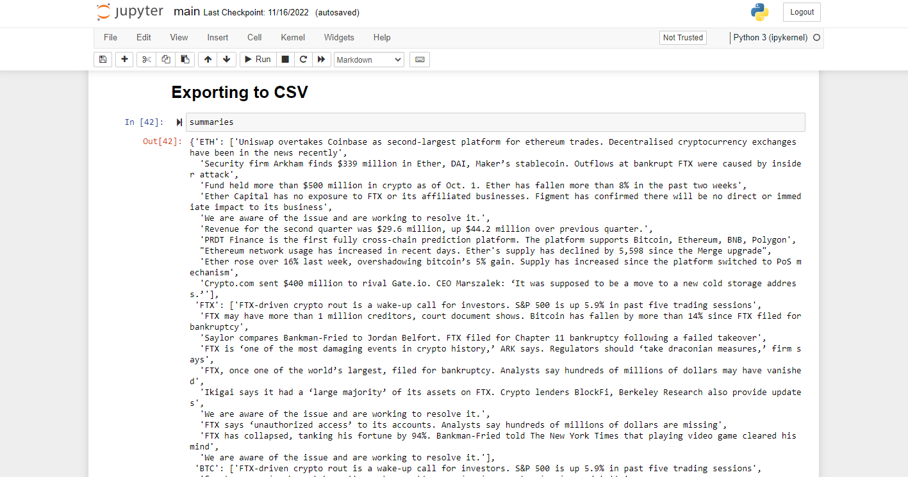

<h1 align="center">
  <br>
  Stocks and Crypto Sentiment Analysis
  <br>
</h1>

<h4 align="center">A python script that generates sentimental analysis for your crypto or stock you wish to buy or sell or you want to research about as a csv file in your local machine.</h4>

</p>



<h2>
  <br>
  Stocks and Crypto Sentiment Analysis
  <br>
</h2>

To clone and run this application, you'll need [Git](https://git-scm.com) and [Python3](https://www.python.org//) installed on your computer. From your command line:

```bash
# Clone this repository
$ git clone https://github.com/marpit19/Stocks-and-Crypto-Research.git

# Go into the repository
$ cd Stocks-and-Crypto-Research

# Install dependencies
$ python main.py

```

<h2>
  <br>
  License
  <br>
</h2>

MIT

